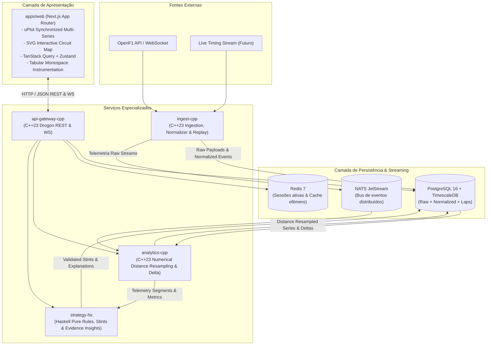
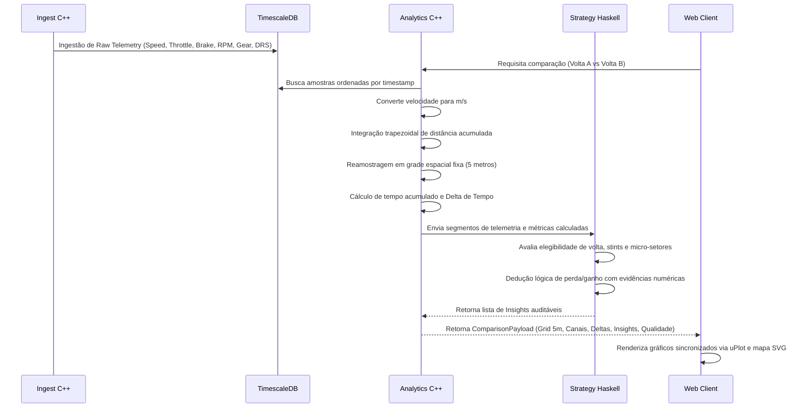

# ApexTelemetry — Arquitetura do Sistema

## 1. Visão Geral

O **ApexTelemetry** é uma plataforma de engenharia para análise aprofundada de telemetria de Fórmula 1 voltada a engenheiros, analistas de performance e criadores de conteúdo técnico. O sistema foi desenhado segundo princípios de computação de alta performance e determinismo analítico:

1. **Alta Densidade e Baixa Latência (C++23)**: Ingestão, normalização, reamostragem espacial (distância) e cálculos numéricos pesados executados nativamente.
2. **Determinismo e Explicabilidade Formal (Haskell)**: Classificação de voltas, stints, estratégias e geração de insights auditáveis baseados exclusivamente em evidências empíricas e tipos estritos.
3. **Interface Técnica de Engenharia (Next.js / TypeScript / uPlot / SVG)**: Experiência visual sóbria estilo instrumentação de telemetria de pista, com crosshair sincronizado em 60fps, mapas de circuito vetoriais com delta heatmap e dados tabulares mono-espaçados.

---

## 2. Fronteiras de Responsabilidade e Separação de Serviços

| Serviço | Linguagem / Stack | Papel Operacional | Justificativa Técnica |
| :--- | :--- | :--- | :--- |
| **`ingest-cpp`** | C++23, libcurl, simdjson, libpqxx, NATS C++ | Ingestão resiliente, retry exponencial, parse ultra-rápido de JSON, normalização e publicação em streaming. | Zero-allocation parsing via simdjson, throughput de dezenas de milhares de amostras/s, controle fino de memória. |
| **`analytics-cpp`** | C++23, Eigen / std::valarray, Drogon / Boost.Asio | Reamostragem espacial baseada em distância cumulativa ($\Delta d = v \cdot \Delta t$), interpolação spline/linear com salvaguardas, cálculo de delta temporal e alinhamento de canais. | Cálculos vetoriais paralelizáveis com vetores contíguos de memória em cache L1/L2, sem garbage collection. |
| **`strategy-hs`** | Haskell (GHC), Servant, Aeson, Hasql | Classificação categórica de voltas (`flying`, `out-lap`, `in-lap`, `safety-car`), stints de pneus, validação de integridade e geração de insights explicáveis. | O sistema de tipos algébricos e pureza funcional previne estados inválidos e garante regras auditáveis de inferência sem efeitos colaterais. |
| **`api-gateway-cpp`**| C++23, Drogon, redis-plus-plus | Ponto único de entrada REST e WebSocket multiplexado para o frontend, autenticação e rate-limiting. | Baixíssima latência na entrega de pacotes de telemetria serializados e suporte massivo a conexões WS simultâneas. |
| **`apps/web`** | Next.js 15, TypeScript Strict, Tailwind CSS, uPlot, D3, SVG | Dashboard de engenharia de alta fidelidade com visual escuro graphite, crosshair unificado entre telemetria e mapa de pista. | Renderização rápida via Canvas/uPlot, reatividade isolada via Zustand e tipagem ponta a ponta. |

---

## 3. Qualidade, Cobertura e Limitações dos Dados Públicos

Dados de telemetria pública (como OpenF1) possuem características distintas de telemetria proprietária de equipes (ATLAS / Wintax / MoTeC):

1. **Taxa de Amostragem Variável**: OpenF1 agrega dados de broadcast a taxas que oscilam entre 3 Hz e 10 Hz para canais de carro, ao passo que telemetria de ECU oficial opera em 50 Hz – 200 Hz.
2. **Discretização de Marcha e DRS**: O canal de DRS e marchas pode sofrer latência de broadcast (atraso de até 200–500 ms em relação ao sinal real do volante).
3. **Incerteza na Posição Espacial**: Coordenadas X/Y de GPS de broadcast sofrem com oclusões, reflexões multipath e interpolação imprecisa nas zebras.
4. **Política de Transparência do ApexTelemetry**:
   - Todo gráfico e tabela exibe o percentual de cobertura da volta ($n_{\text{amostras}} / n_{\text{esperado}}$).
   - Lacunas temporais $> 500\text{ ms}$ são sinalizadas visualmente como "Incomplete / Discontinuous" e não interpoladas artificialmente.
   - Qualquer inferência do motor de estratégia (Haskell) carrega uma pontuação explícita de confiança (`Confidence: 0.0 - 1.0`) e lista de premissas e limitações.

---

## 4. Pipeline de Processamento Numérico de Voltas

---

## 5. Estratégia de Deploy e Execução Local

O monorepo suporta execução 100% local com orquestração via Docker Compose:
- **TimescaleDB**: Tabela particionada temporalmente por `occurred_at`.
- **Redis**: Armazena sessões ativas e cache de comparações recentes.
- **NATS**: Tópicos `telemetry.raw`, `telemetry.normalized`, `racecontrol.events`.
- **Modo Standalone / Demo**: O frontend conta com um mock determinístico completo baseado em telemetria do GP do Bahrein de 2024 (Verstappen vs Leclerc), explicitamente marcado como fixture de desenvolvimento para permitir trabalho imediato de UI sem dependência de containers externos.
